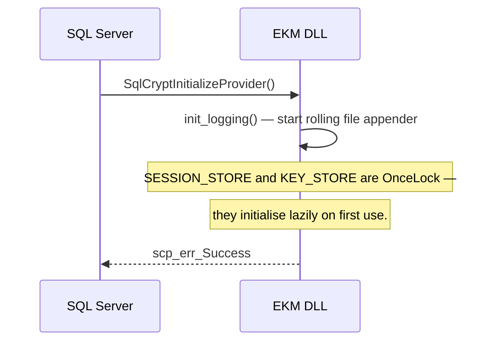
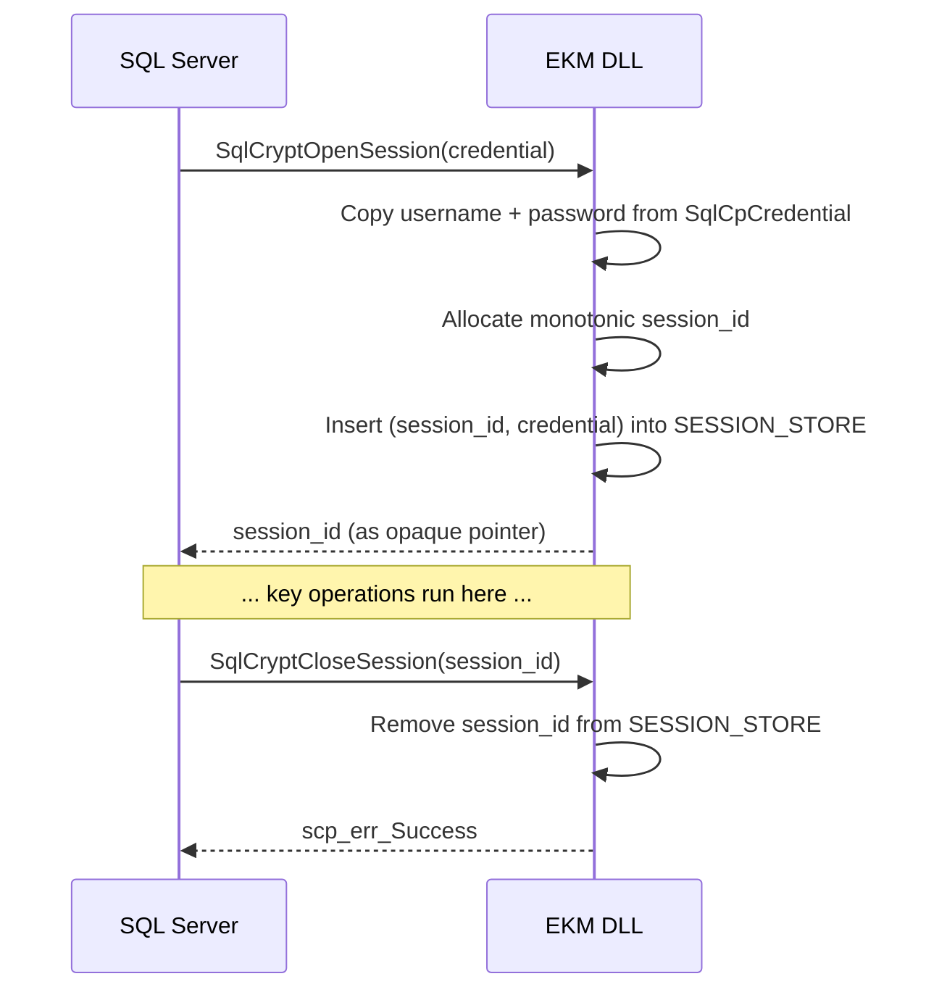
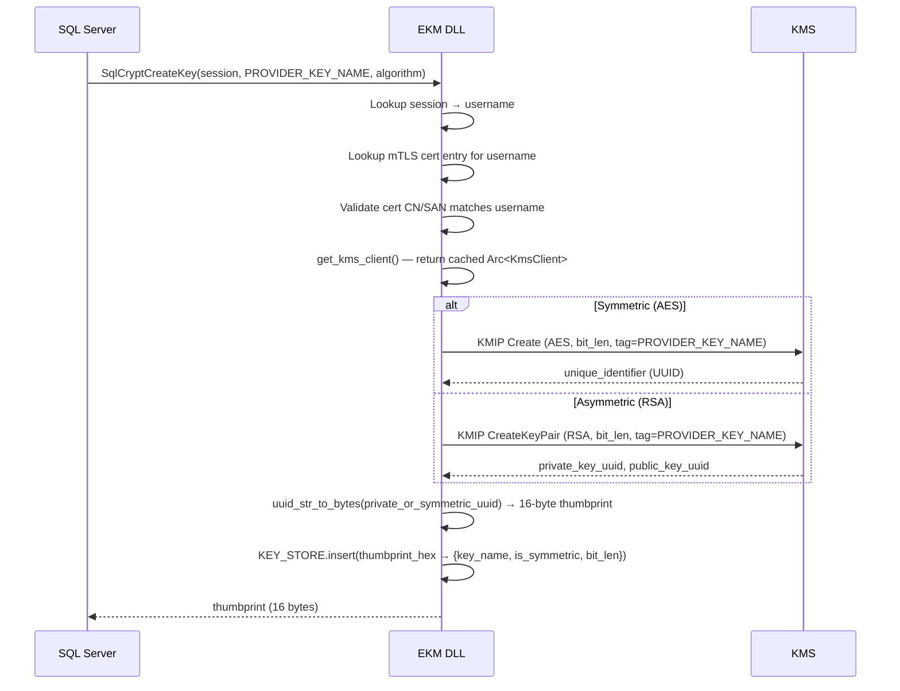
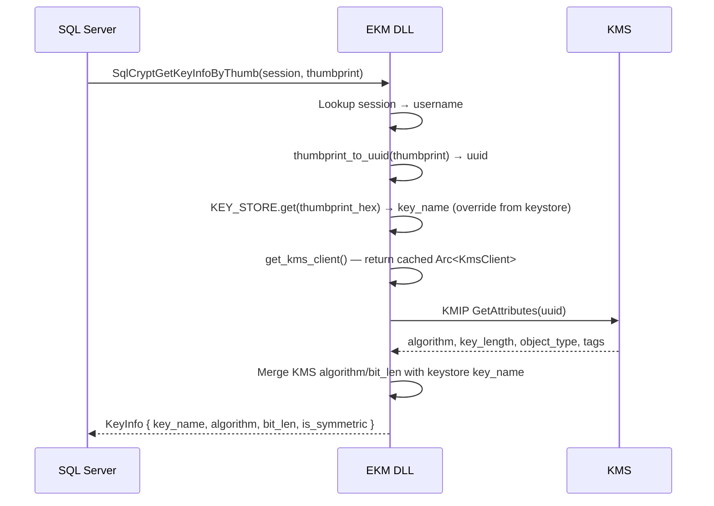
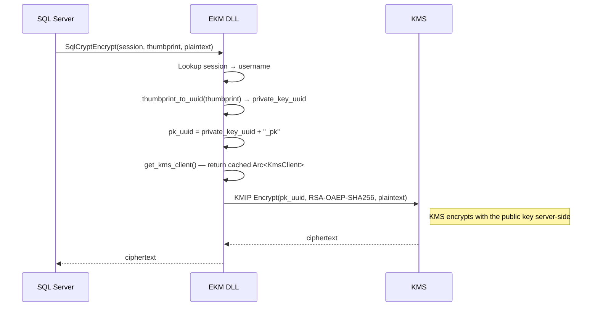
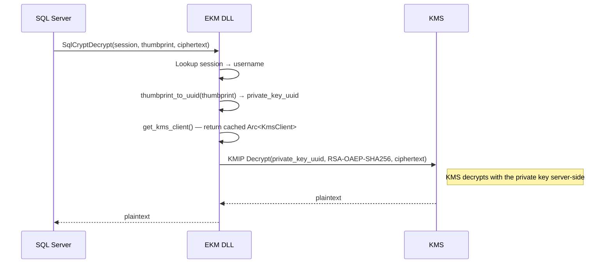
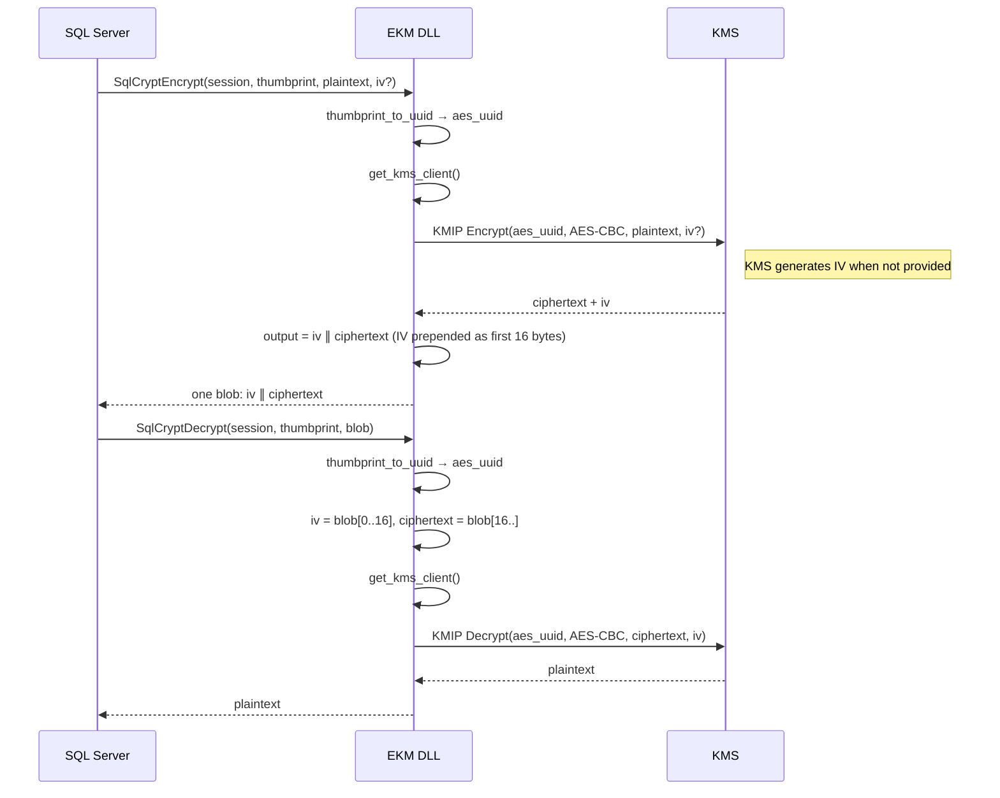
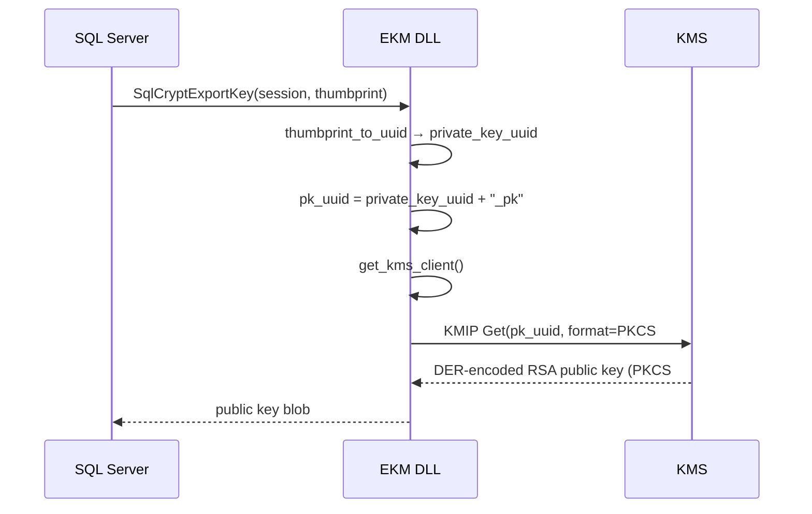
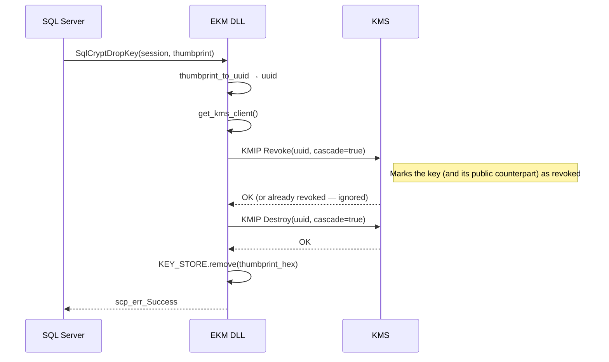
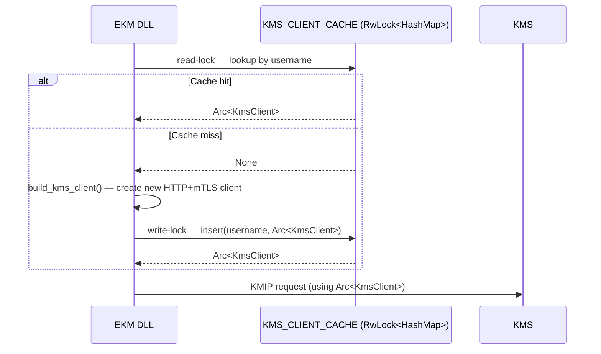

# Cryptographic Flows

Sequence diagrams for the interactions between SQL Server, the Cosmian EKM DLL,
and the Cosmian KMS.  Actors:

- **SQL Server** — the database engine (calls the EKM C API)
- **EKM DLL** — `cosmian_ekm_sql_server.dll` loaded in-process by SQL Server
- **KMS** — Cosmian KMS server (KMIP over HTTPS/mTLS)

---

## Provider initialisation

Called once when SQL Server loads the DLL.

---

## Session open / close

Called for each SQL Server connection that uses EKM keys.

---

## Key creation

`CREATE ASYMMETRIC KEY … FROM PROVIDER` or `CREATE SYMMETRIC KEY … FROM PROVIDER`.

---

## Key info retrieval

`sys.asymmetric_keys`, `sys.symmetric_keys`, or SQL Server internal look-ups
call `SqlCryptGetKeyInfoByThumb`.

---

## RSA encrypt (key wrapping)

SQL Server calls `SqlCryptEncrypt` when opening a symmetric key protected by an
EKM asymmetric key (e.g. `OPEN SYMMETRIC KEY … DECRYPTION BY ASYMMETRIC KEY`
or column-level / TDE key wrapping).

---

## RSA decrypt (key unwrapping)

Called when SQL Server needs to recover the plaintext of a wrapped key.

---

## AES encrypt / decrypt

Used for AES symmetric keys (`CREATE SYMMETRIC KEY … FROM PROVIDER`, algorithm `AES_*`).

---

## Public key export

Called by `SqlCryptExportKey` — SQL Server needs the public key bytes to store in
its metadata (e.g. certificate, `sys.asymmetric_keys`).

---

## Key deletion

`DROP ASYMMETRIC KEY` or `DROP SYMMETRIC KEY`.

---

## KMS client caching

The EKM DLL maintains one `KmsClient` per KMS identity (username) for the
lifetime of the DLL load.  Building a new HTTP/mTLS client is relatively
expensive; caching avoids reopening TLS connections on every SQL Server request.

